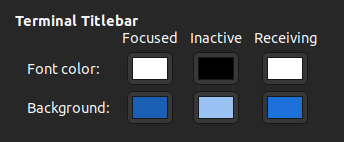

<!-- TOC -->
* [:clipboard: TERMINATOR SETUP](#clipboard-terminator-setup)
  * [:pushpin: PREFERENCES](#pushpin-preferences)
    * [:bell: GLOBAL](#bell-global)
    * [:bell: PROFILES](#bell-profiles)
<!-- TOC -->

# :clipboard: TERMINATOR SETUP

## :pushpin: PREFERENCES

### :bell: GLOBAL

Terminal Titlebar:

General:
- `Hide size from title`

Font:
- Uncheck `Use the system font`
- `Ubuntu Regular 12`

### :bell: PROFILES

Colors:
- Built-in schemes: `White on black`
- `Show bold text in bright colors`